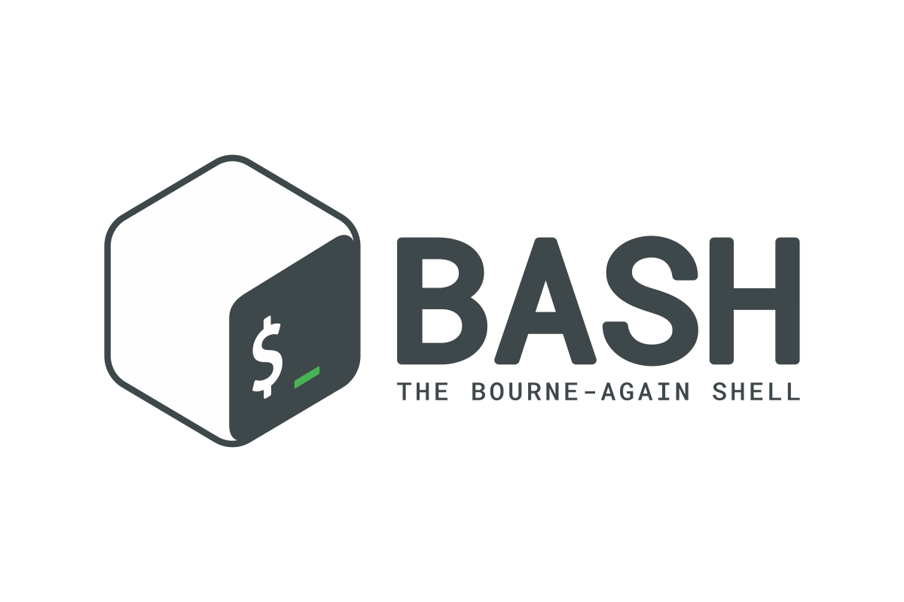
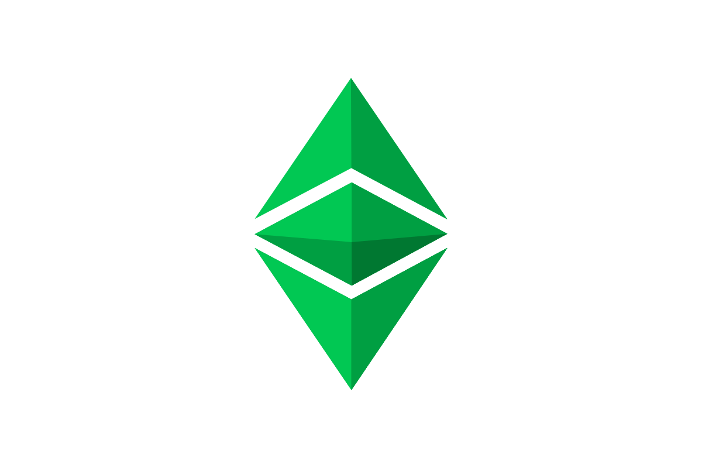
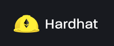
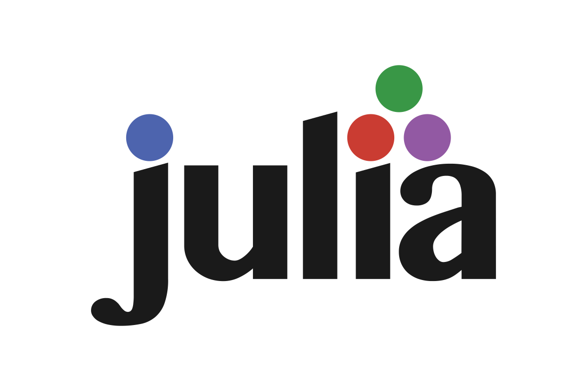
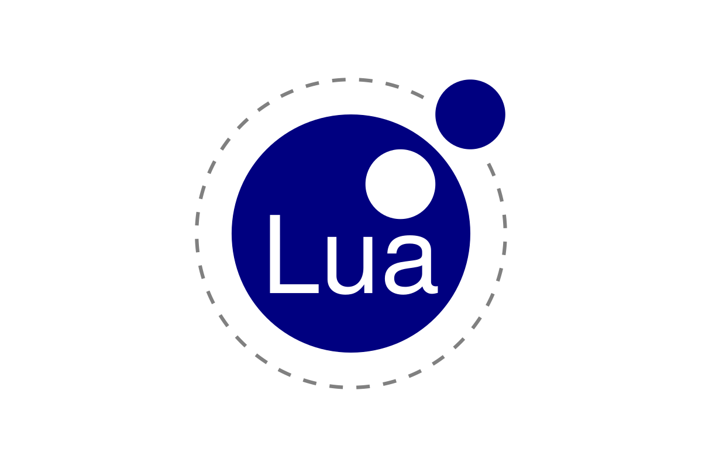
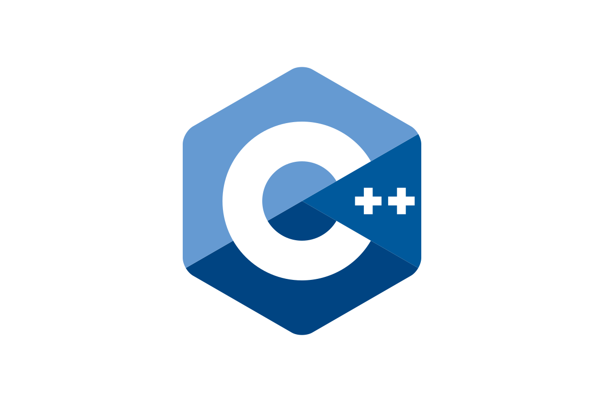

<!-- Background github cover with short introduction down below -->

<h1 align="center">
Hi there , I'm <a href="https://dev.to/flexycode/" target="_blank" rel="noreferrer">Jay</a>
</h1>

<!-- Introduction effect style for I'm a Machine Learning Engineer -->
<h3 align="center">
<a href="https://git.io/typing-svg"></a>
</h3> 

<i class="fab fa-pinterest"></i>

<!-- Button Pannel for Github follers and views -->
<p align="center">


</p>

<!-- Buy me a coffee link :) , you can replace the link if you already have one. Just leave this for now to support my page -->
<div align="center">
<a href="https://buymeacoffee.com/flexycode" target="_blank"></a>
</div>

<!-- Coffee GIF -->
<div align="center">

</div>

```
💎 Hello there! I'm thrilled to have you visit my GitHub profile. Here, you'll find a collection of my projects, contributions, and explorations in the world of software development 💎
```
<br>

<!-- Background github GIF with 3 Luka Doncic down below -->
<div align="center">


<br>
<!-- End point insert background effect line of sight color rainbow -->


<!-- Continuously text animation with short introduction down below -->
<h3 align="center"><a href="https://git.io/typing-svg"></a></h3>
<h3 align="center"><a href="https://git.io/typing-svg"></a></h3> 
<h3 align="center"><a href="https://git.io/typing-svg"></a></h3>
<p align="center"> 
   <a href="https://git.io/typing-svg"></a>
   <a href="https://git.io/typing-svg"></a>
   <a href="https://git.io/typing-svg"></a>
</p>    
</div>
<!-- End point insert background effect line of sight color rainbow -->


<!-- End point insert background effect line of sight color red -->


# 💫 About Me: 
🔭 I’m currently studying on Artificial Intelligence, Machine Learning, Quantum Technology and Biology<br>
👯 I’m looking to collaborate on any Data Science, LLM and Web3 projects<br>
🤝 I’m looking for help to work with Cloud Computing, Artificial Intelligence, Machine Learning, and Blockchain Development<br>
🤝 I would love to level-up my knowledge in BioInformatics, Cyber Security, Quantum Computing, Robotic Process Automation <br>
🌱 I’m currently learning more about Rust, Go, Consensus Algorithm of Blockchain Technology and other Blockchain EVM<br>
🦾 Programming: I'm currently learning more on programming languages such as Python, R, Java & C++ so I can build and implement models.<br>
📈 Probability, statistics, and linear algebra: These are my math buddy needed to implement different AI and machine learning models.<br>
🧊 Big data technologies: AI engineers work with large amounts of data, so I’ll be required to know Apache Spark, Hadoop, and MongoDB.<br>
🤖 Algorithms & frameworks: I'm currently self studying some machine learning algorithms such as linear regression and Naive Bayes,<br> 
🤖 as well as deep learning algorithms such as recurrent neural networks and generative adversarial networks, and be able to implement<br>
🤖 them with a framework. Common AI frameworks include Theano, TensorFlow, Caffe, Keras, and PyTorch.<br>
💬 Ask me about Artificial Intelligence and Machine Learning<br>
🎮 I'm a Dallas Mavericks fan since 2011, guess my idol 🤫
<br> 

<!-- Background github GIF with 3 AI down below -->
<div align="center">


</div>
<!-- End point insert background effect line of sight color red -->


<!-- Link for Other GitHub account and Email Address -->
🌐 Kindly visit my other GitHub profile: [flexyledger](https://github.com/flexyledger) for more content related to blockchain development<br>
📫 How to reach me flexycode.dev@gmail.com, flexycode@protonmail.com, flexyledger@gmail.com<br>
<!-- End point insert background effect line of sight color red -->


<!-- Introduction with Final Fantasy GIF table style down below -->
## [Introduction](#introduction)
<div style="display: flex; justify-content: space-between;">


   
  
  
  
  


</div>
<!-- End point insert background effect line of sight color red. Three fun fact description down below -->

⚡Fun fact : I'm good at learning new things and adapting easily <br>
⚡Fun fact : I always read documentation everyday before I begin to code <br>
⚡Fun fact : I love Final Fantasy, Science Fiction, Biology, Architecture, Mutants and Galaxy Adventure <br>
⚡Fun fact : I also play League of Legends, Teamfight Tactics, Wild Rift, Legends of Runeterra, NBA2K <br>
   
<!-- End point insert background effect line of sight color red -->

<!-- Gif Background Custom for flexycode reference, for now it's only League of Legends --> 
<div style="display: flex; justify-content: space-between;">


<!-- Fade-in / Fade-out effect pannel button for Linkedin, Instagram, Facebook and Twitter -->
<div align="center">
<h1>Connect with me on     &nbsp;</h1>
<a href="https://www.linkedin.com/in/flexycode/" target="_blank"></a>
<a href="https://www.instagram.com/lukadoncic/" target="_blank"></a>
<a href="https://web.facebook.com/AlphaOmegaCSDev" target="_blank"></a>
<a href="https://www.x.com/flexyledger" target="_blank"></a>
</div>

<!-- Kento Yamazaki -->
<div align="center">

</div>

<!-- Language and Tools, feel free to revise.
Visit this Github url for more icon preference: https://github.com/tandpfun/skill-icons#readme -->
<div align="center">
<h1>Languages & Tools &nbsp;</h1>

<a href="https://docs.python.org/3/library/index.html"></a>
<a href="https://nodejs.org/en/docs/guides"></a>
<a href="https://docs.oracle.com/en/java/"></a>
<a href="https://developer.android.com/reference"></a>
<a href="https://reactnative.dev/docs/getting-started"></a>
<a href="https://kotlinlang.org/docs/home.html"></a>
<a href="https://legacy.reactjs.org/docs/getting-started.html"></a>
<a href="https://vuejs.org/guide/introduction.html"></a> 
<a href="https://angular.io/start"></a>
<a href="https://www.php.net/manual/en/index.php"></a>
<a href="https://golang.org/doc/"></a> 
<a href="https://doc.rust-lang.org/std/all.html"></a>
<a href="https://docs.soliditylang.org/en/v0.8.25"></a>
<a href="https://docs.github.com/en"></a>
<a href="https://www.linuxfoundation.org"></a>
<a href="https://www.gnu.org/software/bash/manual/bash.html"></a>
<!-- Language and Tools, feel free to revise.
Visit this Github url for more icon preference: https://github.com/tandpfun/skill-icons#readme -->
## 💻 My favorite tools and technologies for Full Stack Devevelopment

<div style="display: flex; align-items: flex-start; align: center">
<table align="center">
  <tr>
    <td align="center" width="96">
        
      <br>React
    </td>
    <td align="center" width="96">
      <a href="#macropower-tech">
        
      </a>
      <br>Python
    </td>
    <td align="center" width="96">
        
      <br>JavaScript
    </td>
    <td align="center" width="96">
        
      <br>C++
    </td>
    <td align="center" width="96">
        
      <br>Webpack
    </td>
    <td align="center" width="96">
        
      <br>MySQL
    </td>
    <td align="center" width="96">
        
      <br>TypeScript
    </td>
    <td align="center" width="96">
        
      <br>AWS
    </td>
    <td align="center" width="96">
        
      <br>C#
    </td>
  </tr>
  <tr>
  <td align="center" width="96">
        
      <br>Django
    <td align="center" width="96">
        
      <br>Github
    </td>
    <td align="center" width="96"> 
        
      <br>Git
    </td>
    <td align="center"  width="96">
        
      <br>Laravel
    </td>
    <td align="center"  width="96">
        
      <br>HTML5
    </td>
    <td align="center" width="96">
        
      <br>CSS
    </td>
    <td align="center"  width="96">
        
      <br>Bootstrap
    </td>
    <td align="center" width="96">
        
      <br>Tailwind
    </td>
    <td align="center" width="96">
        
      <br>jQuery
    </td>
  </tr>
 <tr>
      <td align="center" width="96">
        
      <br>MongoDB
    </td>
        <td align="center" width="96">
        
      <br>Nodejs
      </td>
      </td>
    <td align="center" width="96">
        
      <br>PHP
    </td>
            <td align="center" width="96">
        
      <br>VsCode
    </td>
              <td align="center" width="96">
        
      <br>WordPress
    </td>
              <td align="center" width="96">
        
      <br>Vue
    </td>
              <td align="center" width="96">
        
      <br>Sass
    </td>
              <td align="center" width="96">
        
      <br>GraphQL
    </td>
    <td align="center" width="96">
        
      <br>PostgreSQL
    </td>
 </tr>
</table>
<br><br>

</div>

<p align="center">
<!-- Language and Tools for Blockchain Development.
Visit this Github url for more icon preference: https://github.com/tandpfun/skill-icons#readme -->
   
## 💻 My tools and technologies for Blockchain Devevelopment
<a href="https://ethereum.org/en"></a>
<a href="https://ethereum.org/en"></a>
<a href="https://docs.soliditylang.org/en/v0.8.25"></a>
<a href="https://www.openzeppelin.com/"></a>
<a href="https://doc.rust-lang.org/std/all.html"></a>
<a href="https://developer.bitcoin.org"></a>
<a href="https://www.linuxfoundation.org"></a>
<a href="https://ubuntu.com/"></a>
<a href="https://remix.ethereum.org/"></a>
<a href="https://hardhat.org/"></a>
   
<!-- Language and Tools for AI and ML Development.
Visit this Github url for more icon preference: https://github.com/tandpfun/skill-icons#readme -->
## 💻 My tools and technologies for AI and ML Devevelopment

<a href="https://docs.python.org/3/library/index.html"></a> 
<a href="https://www.r-project.org"></a>
<a href="https://julialang.org"></a> 
<a href="https://colab.research.google.com/"></a>
<a href="https://devdocs.io/lua~5.4/index#3.4.4"></a>
<a href="https://huggingface.co/"></a>
   
<!-- Language and Tools for Game Development, Architecture and Visualization.
Visit this Github url for more icon preference: https://github.com/tandpfun/skill-icons#readme -->
## 💻 My tools and technologies for Game Devevelopment, Architecture and Visualization
   
<a href="https://devdocs.io/cpp"></a>
<a href="https://devdocs.io/lua~5.4/index#3.4.4"></a> 
<a href="https://www.autodesk.com"></a> 
<a href="https://www.microsoft.com/en-us/download/details.aspx?id=35"></a> 
<a href="https://www.unrealengine.com/en-US"></a>

<!-- Language and Tools for Some Technology Stacks that I use before.
Visit this Github url for more icon preference: https://github.com/tandpfun/skill-icons#readme -->
   
## 💻 Some Technology Stacks that I used:

                              	                          

<!-- End point insert background effect line of sight color red -->


<!-- GitHuB contributions such as GitHuB Workflow Status, GitHub release, GitHub marketplace, Github contribution graph, GitHub Trophies, GitHub Snake Animation Workflow -->
# 📈 GitHub Contribution:

[](https://github.com/Platane/Platane/actions/workflows/main.yml)
[](https://github.com/platane/snk/releases/latest) 
[](https://github.com/marketplace/actions/generate-snake-game-from-github-contribution-grid)


##### My GitHub contributions graph


<a href="https://github.com/flexycode"></a>

# <h2 align="center">GitHub Stats     &nbsp;</h2>
<br/>

<br/>
<!-- For more theme color visit this link https://github.com/anuraghazra/github-readme-stats/blob/master/themes/README.md -->
 

<!-- Edit Next time Harloks WakaTime 
[](https://github.com/anuraghazra/github-readme-stats)
-->
♾️♾️♾️♾️♾️♾️♾️♾️♾️♾️♾️♾️♾️♾️♾️♾️♾️♾️♾️♾️♾️♾️♾️♾️♾️♾️♾️♾️♾️♾️♾️♾️♾️♾️♾️♾️♾️♾️♾️♾️♾️♾️♾️♾️
<!-- End point insert background infinite line of sight color blue -->

## 🏆 GitHub Trophies


## 🏆 GitHub Repository

<!-- Background github GIF with 1 GIF down below -->
<div align="center">


<!-- End point insert background infinite line of sight color blue 

[](https://gist.github.com/flexycode/MLAlgorithms/)

-->
♾️♾️♾️♾️♾️♾️♾️♾️♾️♾️♾️♾️♾️♾️♾️♾️♾️♾️♾️♾️♾️♾️♾️♾️♾️♾️♾️♾️♾️♾️♾️♾️♾️♾️♾️♾️♾️♾️♾️♾️♾️♾️♾️♾️
<!-- End point insert background infinite line of sight color blue -->
<!-- Icons for Commiting message -->
## Icons for Commiting message

| Icons             | 
| ------------------- | 
| ♻️ - refactor getGithubUserContribution | 
| ✨ - read contribution calendar from github api or remove some attributes | 
| 📓 - commit or add readme | 
| 👷 - add manual run, repair | 
| 🚑 - import or also commit | 
| 🔨 - fix algorithm priority | 
| 🚀 - add emojis and style | 
| 🤫 - smiley face can also use for indicator for running or stopping some container | 
| ⛓️ - for linking file or repo | 
| 💱 - using solidity, hardhat or crypto related function | 
| 🧊 - blockchain | 
| 🌐 - networking setting, YAML file | 
| 📋 - List of Content | 

<!-- Icons for Commiting message -->
## Some Programming Language & Technologies Icons for Commiting message

🖨️ Technologies Icons :

| Flexycode            | Flexyledger          |
| ------------------- | ----------------- |
| ➡️ 🚍 Communication  | ➡️ 🧮 Fortran     |
| ➡️ 🧰 Version Control | ➡️ ☎️ Erlang/Elixir |
| ➡️ 🔨 Tools          | ➡️ 🧪 Testing      |
| ➡️ 🌐 Web Dev        | ➡️ 📱 Mobile Dev   |
| ➡️ 📜 JavaScript     | ➡️ ✨ UI/UX        |
| ➡️ ☕ Java           | ➡️ 🧊 Apache       |
| ➡️ ©️ C/C++          | ➡️ 🎮 Game Development |
| ➡️ 🪒 C#             | ➡️ 🔬 Analytics    |
| ➡️ 🐍 Python         | ➡️ 🤖 AI           |
| ➡️ 🐘 PHP            | ➡️ 💾 Database     |
| ➡️ 💎 Ruby           | ➡️ ☁️ Cloud        |
| ➡️ 🦾 Rust           | ➡️ 🖥️ Operating system |
| ➡️ 🐿️ Go             | ➡️ 🤿 DevOps      |
| ➡️ 🍼 How to use this icons?             | ➡️ 🚶 Contribution    |


### ✍️ Random Dev Quote 
 

♾️♾️♾️♾️♾️♾️♾️♾️♾️♾️♾️♾️♾️♾️♾️♾️♾️♾️♾️♾️♾️♾️♾️♾️♾️♾️♾️♾️♾️♾️♾️♾️♾️♾️♾️♾️♾️♾️♾️♾️♾️♾️♾️♾️
<!-- End point insert background infinite line of sight color blue -->
### 🧠🧠 Artificial Intelligence 🛸🛸

♾️♾️♾️♾️♾️♾️♾️♾️♾️♾️♾️♾️♾️♾️♾️♾️♾️♾️♾️♾️♾️♾️♾️♾️♾️♾️♾️♾️♾️♾️♾️♾️♾️♾️♾️♾️♾️♾️♾️♾️♾️♾️♾️♾️
<br>
♾️♾️♾️♾️♾️♾️♾️♾️♾️♾️♾️♾️♾️♾️♾️♾️♾️♾️♾️♾️♾️♾️♾️♾️♾️♾️♾️♾️♾️♾️♾️♾️♾️♾️♾️♾️♾️♾️♾️♾️♾️♾️♾️♾️
<!-- End point insert background infinite line of sight color blue -->

<!-- Sample Code for libraries for Artificial Intelligence -->
```bash 
# Import the necessary libraries for AI
import numpy as np
import pandas as pd 
import tensorflow as tf 

# Define the AI model architecture
model = tf.keras.Sequential()
model.add(tf.keras.layers.Dense(64, activation='relu', input_dim=10))
model.add(tf.keras.layers.Dense(64, activation='relu'))
model.add(tf.keras.layers.Dense(1, activation='sigmoid'))

# Compile and train the AI model
model.compile(optimizer='adam', loss='binary_crossentropy', metrics=['accuracy'])
model.fit(X_train, y_train, epochs=10, batch_size=32)  

# Use the AI model for predictions
predictions = model.predict(X_test) 

``` 
<!-- End point insert background infinite line of sight color blue -->
♾️♾️♾️♾️♾️♾️♾️♾️♾️♾️♾️♾️♾️♾️♾️♾️♾️♾️♾️♾️♾️♾️♾️♾️♾️♾️♾️♾️♾️♾️♾️♾️♾️♾️♾️♾️♾️♾️♾️♾️♾️♾️♾️♾️ 
### 🌐⛓️ Blockchain Technology 💱🧊  

♾️♾️♾️♾️♾️♾️♾️♾️♾️♾️♾️♾️♾️♾️♾️♾️♾️♾️♾️♾️♾️♾️♾️♾️♾️♾️♾️♾️♾️♾️♾️♾️♾️♾️♾️♾️♾️♾️♾️♾️♾️♾️♾️♾️ 
<!-- Background for Cryptocurrency  -->
<div style="display: flex; justify-content: space-between;">


<!-- End point insert background effect line of sight color rainbow -->


<!-- End point insert background infinite line of sight color blue -->
### 🤖🦾 Machine Learning 📈💡


♾️♾️♾️♾️♾️♾️♾️♾️♾️♾️♾️♾️♾️♾️♾️♾️♾️♾️♾️♾️♾️♾️♾️♾️♾️♾️♾️♾️♾️♾️♾️♾️♾️♾️♾️♾️♾️♾️♾️♾️♾️♾️♾️♾️ 
<!-- End point insert background infinite line of sight color blue -->

<!-- Sample Code for libraries for Machine Learning -->
``` bash 
# Import the necessary libraries for ML
import numpy as np
import pandas as pd
from sklearn.model_selection import train_test_split
from sklearn.linear_model import LogisticRegression
from sklearn.metrics import accuracy_score

# Load the dataset
data = pd.read_csv('data.csv') 
X = data.drop('target', axis=1)
y = data['target']

# Split the dataset into training and testing sets
X_train, X_test, y_train, y_test = train_test_split(X, y, test_size=0.2, random_state=42)

# Train a logistic regression model
model = LogisticRegression()
model.fit(X_train, y_train)

# Make predictions on the test set
predictions = model.predict(X_test)

# Calculate the accuracy of the model
accuracy = accuracy_score(y_test, predictions)

```
<!-- End point insert background infinite line of sight color blue -->
♾️♾️♾️♾️♾️♾️♾️♾️♾️♾️♾️♾️♾️♾️♾️♾️♾️♾️♾️♾️♾️♾️♾️♾️♾️♾️♾️♾️♾️♾️♾️♾️♾️♾️♾️♾️♾️♾️♾️♾️♾️♾️♾️♾️ 
♾️♾️♾️♾️♾️♾️♾️♾️♾️♾️♾️♾️♾️♾️♾️♾️♾️♾️♾️♾️♾️♾️♾️♾️♾️♾️♾️♾️♾️♾️♾️♾️♾️♾️♾️♾️♾️♾️♾️♾️♾️♾️♾️♾️ 
<!-- Cryptography and Cybersecurity -->
### 🔑🔐 Cryptography and Cybersecurity 🔒🕵️   

♾️♾️♾️♾️♾️♾️♾️♾️♾️♾️♾️♾️♾️♾️♾️♾️♾️♾️♾️♾️♾️♾️♾️♾️♾️♾️♾️♾️♾️♾️♾️♾️♾️♾️♾️♾️♾️♾️♾️♾️♾️♾️♾️♾️  
<!-- End point insert background infinite line of sight color blue -->


<!-- Introduction Pannel button link, it will redirect to the top -->
#### [Back to Table of Content](#introduction)
---
<!-- Intro point insert background text style line "Thanks for visiting enjoy your day! -->
<p align="center">

</p>
<!-- Link for Discord Channel and  -->

[](htttps://discord.gg/flexyledger#5660) [](https://www.linkedin.com/in/flexycode) [](https://medium.com/@flexycode.dev) [](https://twitter.com/flexyledger)

[](https://visitcount.itsvg.in)

<!-- League of Legends Star Guardian -->
<div style="display: flex; justify-content: space-between;">


<p align="center">

</p>

</p>
<!-- End point insert background text style line "Come back again next time! -->

<div style="display: flex; justify-content: space-between;">


